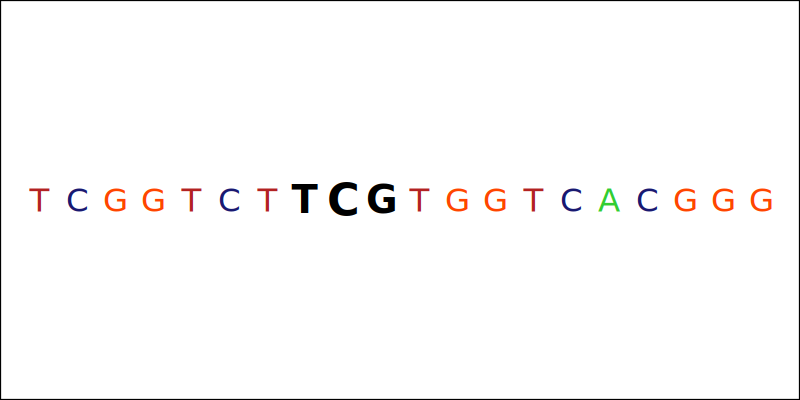

# fasta-region-inspector

## Introduction
fasta-region-inspector (**FRI**) is a bioinformatics tool for analyzing somatic hypermutation (SHM).

## Purpose
Analyzing cancer cohorts for SHM is a interesting cancer-genomics related research question, and one that is computationally intensive.  SHM occurs when immunoglobulin genes accumulate apparently random point mutations within productively rearranged V, D, and J segments, as defined by [Elaine S. Jaffe MD, in Hematopathology, 2017](https://www.sciencedirect.com/topics/immunology-and-microbiology/somatic-hypermutation).  More specifically, [Blood. 2009 Apr 16; 113(16): 3706–3715](https://www.ncbi.nlm.nih.gov/pmc/articles/PMC2670789/) states that the hallmark of SHM is the increased percentage of mutations in hypermutable RGYW motifs.  Correctly identifying SHM in large cancer genomics datasets can be a complex and tedious computational problem. 

This bioinformatics tool gives researchers the ability to answer the following questions:
- Which variants are within 2 kb of the transcription start site (TSS) of the corresponding gene?
- Where do user-defined mapped ambiguity strings lie within 2 kb of the TSS?
- Amalgamating the previous 2 questions, which variant(s) are found within a mapped ambiguity string, that also lie within 2 kb of the TSS?

## Improvements from Previous Implementation

### Overview
This tool aims to answer common SHM variant-level questions in a software package that provides:
- Excellent runtime performance in a robust, functional implementation.
- Minimized memory usage.
- A simple, YAML input file format.
- Clean, informative stdout logging.

### Old vs. New
This version of **FRI** is vastly improved upon in numerous ways, including:
- Optimized file IO via `linear types`.
  - In the previous version, the entire input FASTA file was read into memory (via a compact region), irrespective of the actual needs for the specific analysis.
  - Using `linear types`, system resource usage is provably safe (file handles must be used **once**, and only once).
  - This allows for an incredibly efficient, highly tuned algorithm to seek as close to the TSS sequence as possible, without wasting memory or time.
  - This new and vastly improved method of file IO is a large contributor to the large runtime disparity between the old and new version (**~8X** speedup).
  - This also means that **FRI** now requires only a fraction of the memory that it previously required.
- Much more efficient use of multi-core CPU architecture via multi-threading.
  - The previous version lacked any sense of multi-threading.
  - The new version utilizes scope-delimited thread lifetimes in order to concurrently perform the most computationally expensive functions in parallel.
- A new effect system.
  - The previous version lacked any sort of effect system, mtl or otherwise.
  - The new version introduces effects via the `effectful` ecosystem, which is a series of packages optimized for performance, usability, and clarity.
- More in-depth logging.
  - The previous version handled logging as a simple call to the clock, and a statement.
  - The new version handles logging in a more comprehensive fashion, incorporating thread information (due to the newly introduced multi-threaded computational model, see above), as well as the originating function which contains the logging statement, the level of logging, and finally the current time via the clock.
- General code clean-up.
  - The plethora of default-extensions in the `package.yaml` was removed in favor of a more direct and streamline approach for language extension handling, wherein each individual module contains only the extensions it needs.
  - Many functions/functionality were re-organized into a wider and thinner module structure (slightly more modules, and less code per module) to help with general organization.
- Graphics generation.
  - Graphics are created for each variant that lies within a mapped ambiguity string, and also lies within 2 kb of the TSS.
  - These graphics provide a nice visual representation of the data, replicating and enhancing the type of information one would get from viewing the variant position within IGV.

## Configuration YAML

**FRI** utilizes a configuration YAML file to provide the necessary components for a successful run.

The following keys are **required**:
- ```Fasta``` -> The filepath to the FASTA file. (String)
- ```Fasta_Index``` -> The filepath to the FASTA Index (fai) file. (String)
- ```Variants``` -> A [compact nested mapping](https://yaml.org/spec/1.2.2/#chapter-2-language-overview) (see [below](https://github.com/Matthew-Mosior/Fasta-Region-Inspector/blob/main/README.md#variant-type) for more information).
- ```Ambiguity_Codes``` -> An array of ambiguity codes to search against. (String)
- ```Output_Directory``` -> The filepath to the output directory (must already exist). (String)
- ```Keep_BioMart``` -> Whether or not to keep the BioMart file from the http request. (Boolean)
- ```Ignore_Strandedness``` -> Whether or not to ignore strandness of the respective gene and search the TSS in both directions. (Boolean)
- ```Write_Ambiguity_Codes``` -> Whether or not to write CSV file containing all locations of user-defined mapped ambiguity code strings in TSS window. (Boolean)
- ```Max_Number_of_Concurrent_Threads``` -> The max number of threads to be able to use at any one time. (Int)
  - You can use up to `999` threads.

The following keys are **optional**:
- ```TSS_Window_Size``` -> The TSS window size to search across. (String)
  - The default is 2000 bp.

## Variant Type
The ```Variant``` [compact nested mapping](https://yaml.org/spec/1.2.2/#chapter-2-language-overview) key represents the required information surrounding a variant-of-interest to be examined by **FRI**.

The following keys are **required**:
- ```Sample``` -> The associated sample identifier for the respective variant (String).
- ```HGNC_Symbol``` -> The HGNC symbol for the respective variant (String).
- ```Sequence_Description``` -> The chromosome the respective variant lies within (String).
  - You should include all characters up to the first tab character in the description line.
  - This is based on sequence description lines within the FASTA file. 
  - For example, given this sequence description line, ```>2 dna:chromosome chromosome:GRCh38:2:1:242193529:1 REF```, you would put ```>2```.
- ```Start_Position``` -> The start position for the respective variant (String).
- ```End_Position``` -> The end position for the respective variant (String).
- ```Reference_Allele``` -> The reference allele for the respective variant (String).
- ```Alternate_Allele``` -> The alternate allele for the respective variant (String).
- ```ENST``` -> The ENST for the respective variant (String).

### Notes
The above data can typically be easily grepped/programmed for from the output of a bioinformatics pipeline run, such as the [alignment_exome.cwl](https://github.com/genome/analysis-workflows/blob/master/definitions/pipelines/alignment_exome.cwl).

You can also start from a [VEP](https://useast.ensembl.org/info/docs/tools/vep/index.html)-annotated variant file, which can typically be created once you have run an aligner/variant caller (see above).  Starting from a VEP-annotated file will allow you to filter the variants on gene so that you can better target your analysis with this tool.

## Dependency - Theorem Solver
The program uses the [sbv](https://hackage.haskell.org/package/sbv) package, which interfaces with theorem solver(s).

This package interfaces with one of following supported theorem solvers:
- [ABC](http://www.eecs.berkeley.edu/~alanmi/abc/) from University of Berkeley.
- [Boolector](http://fmv.jku.at/boolector/) from Johannes Kepler University.
- [Bitwuzla](http://bitwuzla.github.io/) from Stanford University.
- [CVC4](http://cvc4.github.io/) and [CVC5](http://cvc5.github.io/) from Stanford University and the University of Iowa.
- [DReal](http://dreal.github.com/) from CMU.
- [MathSAT](http://mathsat.fbk.eu/) from FBK and DISI-University of Trento.
- [Yices](http://yices.csl.sri.com/) from SRI.
- [Z3](http://github.com/Z3Prover/z3/) from Microsoft.

This software has been tested with both Z3 and Yices, although the other theorem solvers listed above should work just as well.

You will need to install and set-up one of the above theorem solvers in order for **FRI** to calculate the mapped ambiguity code string for the given ambiguity code(s).

Please see http://leventerkok.github.io/sbv/ to get more information on how theorem solvers work.

## Dependency - LLVM
**FRI** is set up to compile via [LLVM](https://llvm.org/) instead of using the native code generator.

This will generally take slightly longer than the native code generator to compile. Produced code is generally the same speed or faster than the other two code generators. Compiling via LLVM requires LLVM’s opt and llc executables to be in PATH (taken from GHC documentation).

This means you need the LLVM compiler to compile this code.

If you are on a mac, you can easily install LLVM via brew:

```brew install llvm```

If you are on windows, you can follow [this](https://llvm.org/docs/GettingStartedVS.html) guide to get started with LLVM.

If you are linux/unix, please download and install via your distribution's package manager.

The `package.yaml` file is where this option is set via `ghc-options` using the `-fllvm` flag.

## Building the project
This software was developed on an M1 mac.

You will need:
- The GHC compiler
  - I recommend downloading this via [GHCup](https://www.haskell.org/ghcup/).
- The Haskell Stack Tool (https://docs.haskellstack.org/en/stable/install_and_upgrade/).

It has not been tested on other operating systems or chipsets, but should run perfectly fine on [Stack](https://docs.haskellstack.org/en/stable/README/)-supported operating systems, including:
- Windows
- MacOS
- Ubuntu
- Debian
- Fedora
- Arch Linux
- CentOS
- Red Hat
- Amazon Linux
- openSUSE
- NixOS
- Generic Linux

If you are on an M1 mac, please build the project using the following:
```
% stack build --arch aarch64
```

If you are **NOT** on an M1 mac, please build the project using the following:
```
% stack build
```

## Example Usage
**FRI** is easy to use, as it only requires a single command-line positional argument, the configuration YAML.

If you are on an M1 mac, please run the project using the following:
```
% stack exec --arch aarch64 fasta-region-inspector /path/to/configuration.yaml
```

If you are **NOT** an M1 mac, please run the project using the following:
```
% stack exec fasta-region-inspector /path/to/configuration.yaml
```

## Output
**By default**, **FRI** outputs a single CSV file,namely *variants_in_ambiguity_codes.csv*, containing all of the information needed to answer the questions posed at the top of this README.

Each user-defined variant will be included in this CSV file, with the following fields:
- ```Variant``` -> A description of the user-defined variant.
- ```Region``` -> A description of the region related metadata pulled from BioMart for the user-defined variant.
- ```Variant_Within_Region``` -> A boolean (Y/N) of whether or not the user-defined variant lies within 2 kb of the TSS.
- ```Ambiguity_Code``` -> The user-defined ambiguity code used for the stringsearch.
  - This can be the reverse complement of the user-defined ambiguity code, depending on the strand directionality pulled from BioMart for the variant.
- ```Mapped_Nucleotide_String``` -> The [Satisfiability Modulo Theories](https://hackage.haskell.org/package/sbv) calculated mapped ambuguity code string for the given ambiguity code.
- ```Ambiguity_Code_String_Locations_Within_TSS``` -> The starting position of the first base pair for the mapped nucleotide string.
  - Again, the strand directionality can change which way the mapped nucleotide string is interpreted (see below).

### Notes

```N/A``` values in the ```Ambiguity_Code```, ```Mapped_Nucleotide_String```, or ```Ambiguity_Code_String_Locations_Within_TSS``` fields indicate that the respective variant did not lie within a mapped nucleotide string within 2 kb of the TSS.

Depending on how you set the ```Write_Ambiguity_Codes``` key in the configuration YAML, you can also get an additional CSV file containing all locations of user-defined mapped ambiguity code strings in the TSS window.

## Visualizing the Output
Interpretation of the *variants_in_ambiguity_codes.csv* file is a simple process.

The following example will hopefully help with understanding the output of **FRI**.

### Note

If you wish to follow along with your own data, please download [IGV](https://software.broadinstitute.org/software/igv/).

IGV is a helpful resource for visualizing your results (all of the following screenshots in this section are from IGV). 

### Examine the Mapped Nucleotide String<sup>**Assumes a working knowledge of IGV**</sup>

The following assumes you load the FASTA file used for the **FRI** run.

|Variant|Region|Variant_Within_Region|Ambiguity_Code|Mapped_Nucleotide_String|Ambiguity_Code_String_Locations_Within_TSS|
|-------|------|---------------------|--------------|------------------------|------------------------------------------|
|SMP1:H1-5:chr6:27867219:27867219:G:A:ENST00000331442|6:27867588:&#x200B;-1:H1-5|Y|GYW|GCT|27867220|

Let's take a look at what IGV shows for this particular variant:
<br></br>
<p align="center">
  
</p>
<p align="center">
  The mapped nucleotide string on the forward strand.
</p>
<p align="center">
  
</p>
<p align="center">
  The mapped nucleotide string on the reverse strand.
</p>
 
In IGV, you are able to view a nucleotide sequence in both the forward strand orientation (**1**) and the reverse strand orientation (**-1**) (to do this, click on the arrow icon on the bottom left portion of IGV near **Sequence**).

You can see in the example above that the variant is found on the **reverse** strand.

Because of this, you should focus on the reverse strand within IGV (see the reverse strand image above).

To help orient yourself, the **T** is at position **27867218** and the **G** is at position **27867220** on chromosome 6. 

Our variant-of-interest is the **C**, at position **27867219**, due to it being on the reverse strand (the complement to **G** is **C**, and the input to the tool's ```Reference_Allele``` and ```Alternate_Allele``` are in reference to the forward strand).

Now that you have a better understanding of what the output means, you can be confident in filtering the output file in a way that is congruent with the research question you are trying to answer.

### Graphics Generation

**FRI** generates SVG graphics for each variant that lies within a mapped ambuguity string, and also lies within 2 kb of the TSS.

Graphics are named using the following scheme:

`Sample`_`Sequence_Description`:`Start_Position`-`End_Position`_`Reference_Allele`:`Alternate_Allele`.svg

Currently, the graphics generated show 20 bp centered around the mapped ambuguity string containing the variant-of-interest.

The complement of the forward (`1`) strand (for the 20 bp) will be generated for variants-of-interest who lie in genes with a reverse (`-1`) strand (this feature keeps the graphics in line with what IGV can display).

In graphics generated by **FRI**, the nucleotides that are in slightly larger, black oblique font are the mapped ambiguity string that the variant is found in.

The largest black oblique font nucleotide contained within the mapped ambiguity string is the variant-of-interest.

The hope is that these graphics can serve as a starting point for research grade visualizations/graphics, or even serve as one by themselves when utilizing this tool.

Below is the graphic generated by **FRI** for the variant that was used in the IGV example above:




## Example Stdout (logging)
The following is a real stdout (log) of a **FRI** run:

```
                                ____           __                              _                   _                            __            
                               / __/___ ______/ /_____ _      ________  ____ _(_)___  ____        (_)___  _________  ___  _____/ /_____  _____
                              / /_/ __ `/ ___/ __/ __ `/_____/ ___/ _ \/ __ `/ / __ \/ __ \______/ / __ \/ ___/ __ \/ _ \/ ___/ __/ __ \/ ___/
                             / __/ /_/ (__  ) /_/ /_/ /_____/ /  /  __/ /_/ / / /_/ / / / /_____/ / / / (__  ) /_/ /  __/ /__/ /_/ /_/ / /
                            /_/  \__,_/____/\__/\__,_/     /_/   \___/\__, /_/\____/_/_/_/ ____/_/_/_/_/____/ .___/\___/\___/\__/\____/_/
                                                                     /____/_/ __ \ |__  / / __ \ / __ \    /_/
                                                                     | | / / / / /  /_ < / / / // / / /
                                                                     | |/ / /_/ / ___/ // /_/ // /_/ / 
                                                                     |___/\____(_)____(_)____(_)____/ 
                        
                                                                   Copyright (c) Matthew C. Mosior 2024
  
[2024-02-09 13:33:57.728674078 EST] || LogInfo || ThreadId 4   || runFastaRegionInspector                          || Starting up fasta-region-inspector v0.3.0.0.
[2024-02-09 13:33:57.728793803 EST] || LogInfo || ThreadId 4   || fastaRegionInspect                               || Creating initial striped resource pool.
[2024-02-09 13:33:57.728825172 EST] || LogInfo || ThreadId 4   || fastaRegionInspect                               || Querying BioMart for regions data.
[2024-02-09 13:33:57.728893049 EST] || LogInfo || ThreadId 4   || runQueryBioMart                                  || Generating BioMart compatible XML.
[2024-02-09 13:33:57.736195718 EST] || LogInfo || ThreadId 4   || runQueryBioMart                                  || Querying and downloading region data from BioMart via HTTP request.
[2024-02-09 13:33:58.583491440 EST] || LogInfo || ThreadId 4   || runQueryBioMart                                  || Successfully queried and returned region data from BioMart via HTTP request.
[2024-02-09 13:33:58.583566200 EST] || LogInfo || ThreadId 4   || runQueryBioMart                                  || Writing BioMart region data to file biomartresult.txt in output directory.
[2024-02-09 13:33:58.583759975 EST] || LogInfo || ThreadId 4   || fastaRegionInspect                               || Determining whether each variant is within its respective gene's TSS.
[2024-02-09 13:33:58.583816701 EST] || LogInfo || ThreadId 4   || fastaRegionInspect                               || Massaging TSS determination data into more usable format.
[2024-02-09 13:33:58.583838572 EST] || LogInfo || ThreadId 4   || fastaRegionInspect                               || Calculating the reverse complement of each user defined ambiguity code.
[2024-02-09 13:33:58.583861806 EST] || LogInfo || ThreadId 4   || fastaRegionInspect                               || Creating list of tuples to define directionality of each forward strand ambiguity code.
[2024-02-09 13:33:58.583892844 EST] || LogInfo || ThreadId 4   || fastaRegionInspect                               || Creating list of tuples to define directionality of each reverse strand ambiguity code.
[2024-02-09 13:33:58.583919715 EST] || LogInfo || ThreadId 4   || fastaRegionInspect                               || Generating all possible ambiguity code strings using SMT solver.
[2024-02-09 13:33:58.634665969 EST] || LogInfo || ThreadId 4   || fastaRegionInspect                               || Preparing ambiguity code strings to determine whether each lies within its respective TSS.
[2024-02-09 13:33:58.634728777 EST] || LogInfo || ThreadId 4   || fastaRegionInspect                               || Linearly processing all regions data.
[2024-02-09 13:33:58.634779803 EST] || LogInfo || ThreadId 19  || ambiguityCodesWithinRegionCheckSmall             || Processing region data associated with gene BTG1.
[2024-02-09 13:33:58.634881675 EST] || LogInfo || ThreadId 19  || ambiguityCodesWithinRegionCheckSmall             || Could not process region data associated with current ambiguity code WRC: WRC strand orientation is -1.
[2024-02-09 13:33:58.634911641 EST] || LogInfo || ThreadId 20  || ambiguityCodesWithinRegionCheckSmall             || Processing region data associated with gene MYH10.
[2024-02-09 13:33:58.634948861 EST] || LogInfo || ThreadId 20  || ambiguityCodesWithinRegionCheckSmall             || Could not process region data associated with current ambiguity code WRC: WRC strand orientation is -1.
[2024-02-09 13:33:58.634970181 EST] || LogInfo || ThreadId 21  || ambiguityCodesWithinRegionCheckSmall             || Processing region data associated with gene ARID5B.
[2024-02-09 13:33:58.634991592 EST] || LogInfo || ThreadId 21  || ambiguityCodesWithinRegionCheckSmall             || Reading fasta index file for ARID5B.
[2024-02-09 13:33:58.635120524 EST] || LogInfo || ThreadId 21  || ambiguityCodesWithinRegionCheckSmall             || Reading in fasta file for ARID5B.
[2024-02-09 13:33:58.635032348 EST] || LogInfo || ThreadId 22  || ambiguityCodesWithinRegionCheckSmall             || Processing region data associated with gene EBF1.
[2024-02-09 13:33:58.674516378 EST] || LogInfo || ThreadId 22  || ambiguityCodesWithinRegionCheckSmall             || Could not process region data associated with current ambiguity code WRC: WRC strand orientation is -1.
[2024-02-09 13:33:58.674560621 EST] || LogInfo || ThreadId 24  || ambiguityCodesWithinRegionCheckSmall             || Processing region data associated with gene H1-5.
[2024-02-09 13:33:58.694535645 EST] || LogInfo || ThreadId 24  || ambiguityCodesWithinRegionCheckSmall             || Could not process region data associated with current ambiguity code WRC: WRC strand orientation is -1.
[2024-02-09 13:33:58.694600367 EST] || LogInfo || ThreadId 25  || ambiguityCodesWithinRegionCheckSmall             || Processing region data associated with gene H1-2.
[2024-02-09 13:33:58.714523313 EST] || LogInfo || ThreadId 25  || ambiguityCodesWithinRegionCheckSmall             || Could not process region data associated with current ambiguity code WRC: WRC strand orientation is -1.
[2024-02-09 13:33:58.714570712 EST] || LogInfo || ThreadId 26  || ambiguityCodesWithinRegionCheckSmall             || Processing region data associated with gene SGK1.
[2024-02-09 13:33:58.714593625 EST] || LogInfo || ThreadId 26  || ambiguityCodesWithinRegionCheckSmall             || Could not process region data associated with current ambiguity code WRC: WRC strand orientation is -1.
[2024-02-09 13:33:58.714610577 EST] || LogInfo || ThreadId 27  || ambiguityCodesWithinRegionCheckSmall             || Processing region data associated with gene IL4R.
[2024-02-09 13:33:58.734529434 EST] || LogInfo || ThreadId 27  || ambiguityCodesWithinRegionCheckSmall             || Reading fasta index file for IL4R.
[2024-02-09 13:33:58.734675719 EST] || LogInfo || ThreadId 27  || ambiguityCodesWithinRegionCheckSmall             || Reading in fasta file for IL4R.
[2024-02-09 13:33:58.734591330 EST] || LogInfo || ThreadId 28  || ambiguityCodesWithinRegionCheckSmall             || Processing region data associated with gene AFF3.
[2024-02-09 13:33:58.794760439 EST] || LogInfo || ThreadId 28  || ambiguityCodesWithinRegionCheckSmall             || Could not process region data associated with current ambiguity code WRC: WRC strand orientation is -1.
[2024-02-09 13:33:58.794814090 EST] || LogInfo || ThreadId 30  || ambiguityCodesWithinRegionCheckSmall             || Processing region data associated with gene CXCR4.
[2024-02-09 13:33:58.834517965 EST] || LogInfo || ThreadId 30  || ambiguityCodesWithinRegionCheckSmall             || Could not process region data associated with current ambiguity code WRC: WRC strand orientation is -1.
[2024-02-09 13:33:58.834567468 EST] || LogInfo || ThreadId 31  || ambiguityCodesWithinRegionCheckSmall             || Processing region data associated with gene GNA13.
[2024-02-09 13:33:58.874515841 EST] || LogInfo || ThreadId 31  || ambiguityCodesWithinRegionCheckSmall             || Could not process region data associated with current ambiguity code WRC: WRC strand orientation is -1.
[2024-02-09 13:33:58.874563771 EST] || LogInfo || ThreadId 32  || ambiguityCodesWithinRegionCheckSmall             || Processing region data associated with gene IGLL5.
[2024-02-09 13:33:58.914517956 EST] || LogInfo || ThreadId 32  || ambiguityCodesWithinRegionCheckSmall             || Reading fasta index file for IGLL5.
[2024-02-09 13:33:58.914674470 EST] || LogInfo || ThreadId 32  || ambiguityCodesWithinRegionCheckSmall             || Reading in fasta file for IGLL5.
[2024-02-09 13:33:58.914577699 EST] || LogInfo || ThreadId 33  || ambiguityCodesWithinRegionCheckSmall             || Processing region data associated with gene BCL7A.
[2024-02-09 13:33:58.994515724 EST] || LogInfo || ThreadId 33  || ambiguityCodesWithinRegionCheckSmall             || Reading fasta index file for BCL7A.
[2024-02-09 13:33:58.994624859 EST] || LogInfo || ThreadId 33  || ambiguityCodesWithinRegionCheckSmall             || Reading in fasta file for BCL7A.
[2024-02-09 13:33:58.994571358 EST] || LogInfo || ThreadId 35  || ambiguityCodesWithinRegionCheckSmall             || Processing region data associated with gene CD83.
[2024-02-09 13:33:59.094515635 EST] || LogInfo || ThreadId 35  || ambiguityCodesWithinRegionCheckSmall             || Reading fasta index file for CD83.
[2024-02-09 13:33:59.094637875 EST] || LogInfo || ThreadId 35  || ambiguityCodesWithinRegionCheckSmall             || Reading in fasta file for CD83.
[2024-02-09 13:33:59.094574035 EST] || LogInfo || ThreadId 37  || ambiguityCodesWithinRegionCheckSmall             || Processing region data associated with gene H2AC16.
[2024-02-09 13:33:59.214529755 EST] || LogInfo || ThreadId 37  || ambiguityCodesWithinRegionCheckSmall             || Reading fasta index file for H2AC16.
[2024-02-09 13:33:59.214666642 EST] || LogInfo || ThreadId 37  || ambiguityCodesWithinRegionCheckSmall             || Reading in fasta file for H2AC16.
[2024-02-09 13:33:59.214587363 EST] || LogInfo || ThreadId 39  || ambiguityCodesWithinRegionCheckSmall             || Processing region data associated with gene TP53.
[2024-02-09 13:33:59.215041447 EST] || LogInfo || ThreadId 39  || ambiguityCodesWithinRegionCheckSmall             || Could not process region data associated with current ambiguity code WRC: WRC strand orientation is -1.
[2024-02-09 13:33:59.354494201 EST] || LogInfo || ThreadId 41  || ambiguityCodesWithinRegionCheckSmall             || Processing region data associated with gene SOCS1.
[2024-02-09 13:33:59.354530870 EST] || LogInfo || ThreadId 41  || ambiguityCodesWithinRegionCheckSmall             || Could not process region data associated with current ambiguity code WRC: WRC strand orientation is -1.
[2024-02-09 13:34:00.635412934 EST] || LogInfo || ThreadId 35  || ambiguityCodesWithinRegionCheckSmall             || Grabbing all mapped ambiguity string locations for CD83.
[2024-02-09 13:34:00.635469420 EST] || LogInfo || ThreadId 35  || subStrLocationsSmallForward                      || Processing mapped ambiguity code AGC.
[2024-02-09 13:34:00.635504816 EST] || LogInfo || ThreadId 35  || subStrLocationsSmallForward                      || Processing mapped ambiguity code TGC.
[2024-02-09 13:34:00.635526778 EST] || LogInfo || ThreadId 35  || subStrLocationsSmallForward                      || Processing mapped ambiguity code AAC.
[2024-02-09 13:34:00.635547467 EST] || LogInfo || ThreadId 35  || subStrLocationsSmallForward                      || Processing mapped ambiguity code TAC.
[2024-02-09 13:34:01.192536794 EST] || LogInfo || ThreadId 27  || ambiguityCodesWithinRegionCheckSmall             || Grabbing all mapped ambiguity string locations for IL4R.
[2024-02-09 13:34:01.192593290 EST] || LogInfo || ThreadId 27  || subStrLocationsSmallForward                      || Processing mapped ambiguity code AGC.
[2024-02-09 13:34:01.192613308 EST] || LogInfo || ThreadId 27  || subStrLocationsSmallForward                      || Processing mapped ambiguity code TGC.
[2024-02-09 13:34:01.192627504 EST] || LogInfo || ThreadId 27  || subStrLocationsSmallForward                      || Processing mapped ambiguity code AAC.
[2024-02-09 13:34:01.192641120 EST] || LogInfo || ThreadId 27  || subStrLocationsSmallForward                      || Processing mapped ambiguity code TAC.
[2024-02-09 13:34:01.256505827 EST] || LogInfo || ThreadId 32  || ambiguityCodesWithinRegionCheckSmall             || Grabbing all mapped ambiguity string locations for IGLL5.
[2024-02-09 13:34:01.256564638 EST] || LogInfo || ThreadId 32  || subStrLocationsSmallForward                      || Processing mapped ambiguity code AGC.
[2024-02-09 13:34:01.256584054 EST] || LogInfo || ThreadId 32  || subStrLocationsSmallForward                      || Processing mapped ambiguity code TGC.
[2024-02-09 13:34:01.256598932 EST] || LogInfo || ThreadId 32  || subStrLocationsSmallForward                      || Processing mapped ambiguity code AAC.
[2024-02-09 13:34:01.256612628 EST] || LogInfo || ThreadId 32  || subStrLocationsSmallForward                      || Processing mapped ambiguity code TAC.
[2024-02-09 13:34:01.708527123 EST] || LogInfo || ThreadId 37  || ambiguityCodesWithinRegionCheckSmall             || Grabbing all mapped ambiguity string locations for H2AC16.
[2024-02-09 13:34:01.708578479 EST] || LogInfo || ThreadId 37  || subStrLocationsSmallForward                      || Processing mapped ambiguity code AGC.
[2024-02-09 13:34:01.708597044 EST] || LogInfo || ThreadId 37  || subStrLocationsSmallForward                      || Processing mapped ambiguity code TGC.
[2024-02-09 13:34:01.708610910 EST] || LogInfo || ThreadId 37  || subStrLocationsSmallForward                      || Processing mapped ambiguity code AAC.
[2024-02-09 13:34:01.708624786 EST] || LogInfo || ThreadId 37  || subStrLocationsSmallForward                      || Processing mapped ambiguity code TAC.
[2024-02-09 13:34:02.547980338 EST] || LogInfo || ThreadId 21  || ambiguityCodesWithinRegionCheckSmall             || Grabbing all mapped ambiguity string locations for ARID5B.
[2024-02-09 13:34:02.548035262 EST] || LogInfo || ThreadId 21  || subStrLocationsSmallForward                      || Processing mapped ambiguity code AGC.
[2024-02-09 13:34:02.548054027 EST] || LogInfo || ThreadId 21  || subStrLocationsSmallForward                      || Processing mapped ambiguity code TGC.
[2024-02-09 13:34:02.548068444 EST] || LogInfo || ThreadId 21  || subStrLocationsSmallForward                      || Processing mapped ambiguity code AAC.
[2024-02-09 13:34:02.548082400 EST] || LogInfo || ThreadId 21  || subStrLocationsSmallForward                      || Processing mapped ambiguity code TAC.
[2024-02-09 13:34:03.884803896 EST] || LogInfo || ThreadId 33  || ambiguityCodesWithinRegionCheckSmall             || Grabbing all mapped ambiguity string locations for BCL7A.
[2024-02-09 13:34:03.884854891 EST] || LogInfo || ThreadId 33  || subStrLocationsSmallForward                      || Processing mapped ambiguity code AGC.
[2024-02-09 13:34:03.884874839 EST] || LogInfo || ThreadId 33  || subStrLocationsSmallForward                      || Processing mapped ambiguity code TGC.
[2024-02-09 13:34:03.884888294 EST] || LogInfo || ThreadId 33  || subStrLocationsSmallForward                      || Processing mapped ambiguity code AAC.
[2024-02-09 13:34:03.884900778 EST] || LogInfo || ThreadId 33  || subStrLocationsSmallForward                      || Processing mapped ambiguity code TAC.
[2024-02-09 13:34:03.884981269 EST] || LogInfo || ThreadId 42  || ambiguityCodesWithinRegionCheckSmall             || Processing region data associated with gene BTG1.
[2024-02-09 13:34:03.885007388 EST] || LogInfo || ThreadId 42  || ambiguityCodesWithinRegionCheckSmall             || Reading fasta index file for BTG1.
[2024-02-09 13:34:03.885103058 EST] || LogInfo || ThreadId 42  || ambiguityCodesWithinRegionCheckSmall             || Reading in fasta file for BTG1.
[2024-02-09 13:34:03.885034168 EST] || LogInfo || ThreadId 43  || ambiguityCodesWithinRegionCheckSmall             || Processing region data associated with gene MYH10.
[2024-02-09 13:34:03.885640989 EST] || LogInfo || ThreadId 43  || ambiguityCodesWithinRegionCheckSmall             || Reading fasta index file for MYH10.
[2024-02-09 13:34:03.887160246 EST] || LogInfo || ThreadId 43  || ambiguityCodesWithinRegionCheckSmall             || Reading in fasta file for MYH10.
[2024-02-09 13:34:03.914501659 EST] || LogInfo || ThreadId 44  || ambiguityCodesWithinRegionCheckSmall             || Processing region data associated with gene ARID5B.
[2024-02-09 13:34:03.914598692 EST] || LogInfo || ThreadId 44  || ambiguityCodesWithinRegionCheckSmall             || Could not process region data associated with current ambiguity code GYW: GYW strand orientation is 1.
[2024-02-09 13:34:03.914570980 EST] || LogInfo || ThreadId 45  || ambiguityCodesWithinRegionCheckSmall             || Processing region data associated with gene EBF1.
[2024-02-09 13:34:03.914636342 EST] || LogInfo || ThreadId 45  || ambiguityCodesWithinRegionCheckSmall             || Reading fasta index file for EBF1.
[2024-02-09 13:34:03.914730670 EST] || LogInfo || ThreadId 45  || ambiguityCodesWithinRegionCheckSmall             || Reading in fasta file for EBF1.
[2024-02-09 13:34:03.914664185 EST] || LogInfo || ThreadId 46  || ambiguityCodesWithinRegionCheckSmall             || Processing region data associated with gene H1-5.
[2024-02-09 13:34:03.934524844 EST] || LogInfo || ThreadId 46  || ambiguityCodesWithinRegionCheckSmall             || Reading fasta index file for H1-5.
[2024-02-09 13:34:03.934605916 EST] || LogInfo || ThreadId 46  || ambiguityCodesWithinRegionCheckSmall             || Reading in fasta file for H1-5.
[2024-02-09 13:34:04.014509198 EST] || LogInfo || ThreadId 50  || ambiguityCodesWithinRegionCheckSmall             || Processing region data associated with gene H1-2.
[2024-02-09 13:34:04.014575182 EST] || LogInfo || ThreadId 50  || ambiguityCodesWithinRegionCheckSmall             || Reading fasta index file for H1-2.
[2024-02-09 13:34:04.014694436 EST] || LogInfo || ThreadId 50  || ambiguityCodesWithinRegionCheckSmall             || Reading in fasta file for H1-2.
[2024-02-09 13:34:04.014617932 EST] || LogInfo || ThreadId 51  || ambiguityCodesWithinRegionCheckSmall             || Processing region data associated with gene SGK1.
[2024-02-09 13:34:04.015337715 EST] || LogInfo || ThreadId 51  || ambiguityCodesWithinRegionCheckSmall             || Reading fasta index file for SGK1.
[2024-02-09 13:34:04.016144602 EST] || LogInfo || ThreadId 51  || ambiguityCodesWithinRegionCheckSmall             || Reading in fasta file for SGK1.
[2024-02-09 13:34:04.054493500 EST] || LogInfo || ThreadId 52  || ambiguityCodesWithinRegionCheckSmall             || Processing region data associated with gene IL4R.
[2024-02-09 13:34:04.054523106 EST] || LogInfo || ThreadId 52  || ambiguityCodesWithinRegionCheckSmall             || Could not process region data associated with current ambiguity code GYW: GYW strand orientation is 1.
[2024-02-09 13:34:04.174483327 EST] || LogInfo || ThreadId 56  || ambiguityCodesWithinRegionCheckSmall             || Processing region data associated with gene AFF3.
[2024-02-09 13:34:04.174525686 EST] || LogInfo || ThreadId 56  || ambiguityCodesWithinRegionCheckSmall             || Reading fasta index file for AFF3.
[2024-02-09 13:34:04.174664046 EST] || LogInfo || ThreadId 56  || ambiguityCodesWithinRegionCheckSmall             || Reading in fasta file for AFF3.
[2024-02-09 13:34:04.174558287 EST] || LogInfo || ThreadId 57  || ambiguityCodesWithinRegionCheckSmall             || Processing region data associated with gene CXCR4.
[2024-02-09 13:34:04.174847211 EST] || LogInfo || ThreadId 57  || ambiguityCodesWithinRegionCheckSmall             || Reading fasta index file for CXCR4.
[2024-02-09 13:34:04.175629411 EST] || LogInfo || ThreadId 57  || ambiguityCodesWithinRegionCheckSmall             || Reading in fasta file for CXCR4.
[2024-02-09 13:34:04.214487137 EST] || LogInfo || ThreadId 58  || ambiguityCodesWithinRegionCheckSmall             || Processing region data associated with gene GNA13.
[2024-02-09 13:34:04.214565194 EST] || LogInfo || ThreadId 58  || ambiguityCodesWithinRegionCheckSmall             || Reading fasta index file for GNA13.
[2024-02-09 13:34:04.214683216 EST] || LogInfo || ThreadId 58  || ambiguityCodesWithinRegionCheckSmall             || Reading in fasta file for GNA13.
[2024-02-09 13:34:04.214599037 EST] || LogInfo || ThreadId 59  || ambiguityCodesWithinRegionCheckSmall             || Processing region data associated with gene IGLL5.
[2024-02-09 13:34:04.234521543 EST] || LogInfo || ThreadId 59  || ambiguityCodesWithinRegionCheckSmall             || Could not process region data associated with current ambiguity code GYW: GYW strand orientation is 1.
[2024-02-09 13:34:04.234557460 EST] || LogInfo || ThreadId 60  || ambiguityCodesWithinRegionCheckSmall             || Processing region data associated with gene BCL7A.
[2024-02-09 13:34:04.234588238 EST] || LogInfo || ThreadId 60  || ambiguityCodesWithinRegionCheckSmall             || Could not process region data associated with current ambiguity code GYW: GYW strand orientation is 1.
[2024-02-09 13:34:04.414509829 EST] || LogInfo || ThreadId 64  || ambiguityCodesWithinRegionCheckSmall             || Processing region data associated with gene CD83.
[2024-02-09 13:34:04.414549754 EST] || LogInfo || ThreadId 65  || ambiguityCodesWithinRegionCheckSmall             || Processing region data associated with gene H2AC16.
[2024-02-09 13:34:04.414559763 EST] || LogInfo || ThreadId 66  || ambiguityCodesWithinRegionCheckSmall             || Processing region data associated with gene TP53.
[2024-02-09 13:34:04.414568549 EST] || LogInfo || ThreadId 67  || ambiguityCodesWithinRegionCheckSmall             || Processing region data associated with gene SOCS1.
[2024-02-09 13:34:05.171959034 EST] || LogInfo || ThreadId 43  || ambiguityCodesWithinRegionCheckSmall             || Grabbing all mapped ambiguity string locations for MYH10.
[2024-02-09 13:34:06.094508470 EST] || LogInfo || ThreadId 64  || ambiguityCodesWithinRegionCheckSmall             || Could not process region data associated with current ambiguity code GYW: GYW strand orientation is 1.
[2024-02-09 13:34:06.254509683 EST] || LogInfo || ThreadId 65  || ambiguityCodesWithinRegionCheckSmall             || Could not process region data associated with current ambiguity code GYW: GYW strand orientation is 1.
[2024-02-09 13:34:06.414508960 EST] || LogInfo || ThreadId 66  || ambiguityCodesWithinRegionCheckSmall             || Reading fasta index file for TP53.
[2024-02-09 13:34:06.574509412 EST] || LogInfo || ThreadId 67  || ambiguityCodesWithinRegionCheckSmall             || Reading fasta index file for SOCS1.
[2024-02-09 13:34:07.534497312 EST] || LogInfo || ThreadId 43  || subStrLocationsSmallReverse                      || Processing mapped ambiguity code GCT.
[2024-02-09 13:34:07.951658473 EST] || LogInfo || ThreadId 50  || ambiguityCodesWithinRegionCheckSmall             || Grabbing all mapped ambiguity string locations for H1-2.
[2024-02-09 13:34:08.148087044 EST] || LogInfo || ThreadId 46  || ambiguityCodesWithinRegionCheckSmall             || Grabbing all mapped ambiguity string locations for H1-5.
[2024-02-09 13:34:08.734859358 EST] || LogInfo || ThreadId 66  || ambiguityCodesWithinRegionCheckSmall             || Reading in fasta file for TP53.
[2024-02-09 13:34:08.854537772 EST] || LogInfo || ThreadId 67  || ambiguityCodesWithinRegionCheckSmall             || Reading in fasta file for SOCS1.
[2024-02-09 13:34:09.694514684 EST] || LogInfo || ThreadId 43  || subStrLocationsSmallReverse                      || Processing mapped ambiguity code GTA.
[2024-02-09 13:34:09.814483906 EST] || LogInfo || ThreadId 50  || subStrLocationsSmallReverse                      || Processing mapped ambiguity code GCT.
[2024-02-09 13:34:10.174496779 EST] || LogInfo || ThreadId 46  || subStrLocationsSmallReverse                      || Processing mapped ambiguity code GCT.
[2024-02-09 13:34:11.474530725 EST] || LogInfo || ThreadId 43  || subStrLocationsSmallReverse                      || Processing mapped ambiguity code GCA.
[2024-02-09 13:34:11.634508437 EST] || LogInfo || ThreadId 50  || subStrLocationsSmallReverse                      || Processing mapped ambiguity code GTA.
[2024-02-09 13:34:11.657185132 EST] || LogInfo || ThreadId 66  || ambiguityCodesWithinRegionCheckSmall             || Grabbing all mapped ambiguity string locations for TP53.
[2024-02-09 13:34:11.774507899 EST] || LogInfo || ThreadId 46  || subStrLocationsSmallReverse                      || Processing mapped ambiguity code GTA.
[2024-02-09 13:34:12.211488553 EST] || LogInfo || ThreadId 67  || ambiguityCodesWithinRegionCheckSmall             || Grabbing all mapped ambiguity string locations for SOCS1.
[2024-02-09 13:34:13.019728792 EST] || LogInfo || ThreadId 58  || ambiguityCodesWithinRegionCheckSmall             || Grabbing all mapped ambiguity string locations for GNA13.
[2024-02-09 13:34:13.019788083 EST] || LogInfo || ThreadId 43  || subStrLocationsSmallReverse                      || Processing mapped ambiguity code GTT.
[2024-02-09 13:34:13.114509228 EST] || LogInfo || ThreadId 50  || subStrLocationsSmallReverse                      || Processing mapped ambiguity code GCA.
[2024-02-09 13:34:13.214509850 EST] || LogInfo || ThreadId 66  || subStrLocationsSmallReverse                      || Processing mapped ambiguity code GCT.
[2024-02-09 13:34:13.414511563 EST] || LogInfo || ThreadId 46  || subStrLocationsSmallReverse                      || Processing mapped ambiguity code GCA.
[2024-02-09 13:34:13.914486797 EST] || LogInfo || ThreadId 67  || subStrLocationsSmallReverse                      || Processing mapped ambiguity code GCT.
[2024-02-09 13:34:14.714492352 EST] || LogInfo || ThreadId 58  || subStrLocationsSmallReverse                      || Processing mapped ambiguity code GCT.
[2024-02-09 13:34:14.914508674 EST] || LogInfo || ThreadId 50  || subStrLocationsSmallReverse                      || Processing mapped ambiguity code GTT.
[2024-02-09 13:34:15.014487614 EST] || LogInfo || ThreadId 66  || subStrLocationsSmallReverse                      || Processing mapped ambiguity code GTA.
[2024-02-09 13:34:15.214509027 EST] || LogInfo || ThreadId 46  || subStrLocationsSmallReverse                      || Processing mapped ambiguity code GTT.
[2024-02-09 13:34:15.614487060 EST] || LogInfo || ThreadId 67  || subStrLocationsSmallReverse                      || Processing mapped ambiguity code GTA.
[2024-02-09 13:34:15.630024272 EST] || LogInfo || ThreadId 42  || ambiguityCodesWithinRegionCheckSmall             || Grabbing all mapped ambiguity string locations for BTG1.
[2024-02-09 13:34:16.254485048 EST] || LogInfo || ThreadId 58  || subStrLocationsSmallReverse                      || Processing mapped ambiguity code GTA.
[2024-02-09 13:34:16.405587008 EST] || LogInfo || ThreadId 56  || ambiguityCodesWithinRegionCheckSmall             || Grabbing all mapped ambiguity string locations for AFF3.
[2024-02-09 13:34:16.405608478 EST] || LogInfo || ThreadId 66  || subStrLocationsSmallReverse                      || Processing mapped ambiguity code GCA.
[2024-02-09 13:34:16.814485043 EST] || LogInfo || ThreadId 67  || subStrLocationsSmallReverse                      || Processing mapped ambiguity code GCA.
[2024-02-09 13:34:16.874486624 EST] || LogInfo || ThreadId 42  || subStrLocationsSmallReverse                      || Processing mapped ambiguity code GCT.
[2024-02-09 13:34:17.234484833 EST] || LogInfo || ThreadId 58  || subStrLocationsSmallReverse                      || Processing mapped ambiguity code GCA.
[2024-02-09 13:34:17.294485021 EST] || LogInfo || ThreadId 56  || subStrLocationsSmallReverse                      || Processing mapped ambiguity code GCT.
[2024-02-09 13:34:17.354483344 EST] || LogInfo || ThreadId 66  || subStrLocationsSmallReverse                      || Processing mapped ambiguity code GTT.
[2024-02-09 13:34:17.714483829 EST] || LogInfo || ThreadId 67  || subStrLocationsSmallReverse                      || Processing mapped ambiguity code GTT.
[2024-02-09 13:34:17.774483978 EST] || LogInfo || ThreadId 42  || subStrLocationsSmallReverse                      || Processing mapped ambiguity code GTA.
[2024-02-09 13:34:18.134493960 EST] || LogInfo || ThreadId 58  || subStrLocationsSmallReverse                      || Processing mapped ambiguity code GTT.
[2024-02-09 13:34:18.194494249 EST] || LogInfo || ThreadId 56  || subStrLocationsSmallReverse                      || Processing mapped ambiguity code GTA.
[2024-02-09 13:34:18.289172506 EST] || LogInfo || ThreadId 51  || ambiguityCodesWithinRegionCheckSmall             || Grabbing all mapped ambiguity string locations for SGK1.
[2024-02-09 13:34:18.451540268 EST] || LogInfo || ThreadId 57  || ambiguityCodesWithinRegionCheckSmall             || Grabbing all mapped ambiguity string locations for CXCR4.
[2024-02-09 13:34:18.474493813 EST] || LogInfo || ThreadId 42  || subStrLocationsSmallReverse                      || Processing mapped ambiguity code GCA.
[2024-02-09 13:34:18.614494643 EST] || LogInfo || ThreadId 56  || subStrLocationsSmallReverse                      || Processing mapped ambiguity code GCA.
[2024-02-09 13:34:18.654750620 EST] || LogInfo || ThreadId 51  || subStrLocationsSmallReverse                      || Processing mapped ambiguity code GCT.
[2024-02-09 13:34:18.714494074 EST] || LogInfo || ThreadId 57  || subStrLocationsSmallReverse                      || Processing mapped ambiguity code GCT.
[2024-02-09 13:34:18.754493438 EST] || LogInfo || ThreadId 42  || subStrLocationsSmallReverse                      || Processing mapped ambiguity code GTT.
[2024-02-09 13:34:18.850465308 EST] || LogInfo || ThreadId 45  || ambiguityCodesWithinRegionCheckSmall             || Grabbing all mapped ambiguity string locations for EBF1.
[2024-02-09 13:34:18.850489834 EST] || LogInfo || ThreadId 56  || subStrLocationsSmallReverse                      || Processing mapped ambiguity code GTT.
[2024-02-09 13:34:18.850504291 EST] || LogInfo || ThreadId 51  || subStrLocationsSmallReverse                      || Processing mapped ambiguity code GTA.
[2024-02-09 13:34:18.850520622 EST] || LogInfo || ThreadId 57  || subStrLocationsSmallReverse                      || Processing mapped ambiguity code GTA.
[2024-02-09 13:34:18.850574272 EST] || LogInfo || ThreadId 45  || subStrLocationsSmallReverse                      || Processing mapped ambiguity code GCT.
[2024-02-09 13:34:18.850590683 EST] || LogInfo || ThreadId 51  || subStrLocationsSmallReverse                      || Processing mapped ambiguity code GCA.
[2024-02-09 13:34:18.850601213 EST] || LogInfo || ThreadId 57  || subStrLocationsSmallReverse                      || Processing mapped ambiguity code GCA.
[2024-02-09 13:34:18.850619998 EST] || LogInfo || ThreadId 45  || subStrLocationsSmallReverse                      || Processing mapped ambiguity code GTA.
[2024-02-09 13:34:18.850631560 EST] || LogInfo || ThreadId 51  || subStrLocationsSmallReverse                      || Processing mapped ambiguity code GTT.
[2024-02-09 13:34:18.850640838 EST] || LogInfo || ThreadId 57  || subStrLocationsSmallReverse                      || Processing mapped ambiguity code GTT.
[2024-02-09 13:34:18.850658902 EST] || LogInfo || ThreadId 45  || subStrLocationsSmallReverse                      || Processing mapped ambiguity code GCA.
[2024-02-09 13:34:18.850676455 EST] || LogInfo || ThreadId 45  || subStrLocationsSmallReverse                      || Processing mapped ambiguity code GTT.
[2024-02-09 13:34:18.850706882 EST] || LogInfo || ThreadId 4   || fastaRegionInspect                               || Processing all variant data.
[2024-02-09 13:34:18.850861803 EST] || LogInfo || ThreadId 4   || fastaRegionInspect                               || Preparing variants for final analysis.
[2024-02-09 13:34:18.862093049 EST] || LogInfo || ThreadId 4   || fastaRegionInspect                               || Preparing to output graphics.
[2024-02-09 13:34:18.862124068 EST] || LogInfo || ThreadId 4   || generateGraphics                                 || Filtering out variants that are found within a mapped ambiguity string, and that also lie within 2 kb of the TSS from the final data.
[2024-02-09 13:34:18.862185343 EST] || LogInfo || ThreadId 73  || generateGraphics                                 || Reading fasta index file for ARID5B.
[2024-02-09 13:34:18.862307643 EST] || LogInfo || ThreadId 73  || generateGraphics                                 || Reading in fasta file for ARID5B.
[2024-02-09 13:34:18.862356575 EST] || LogInfo || ThreadId 74  || generateGraphics                                 || Reading fasta index file for BTG1.
[2024-02-09 13:34:18.874537336 EST] || LogInfo || ThreadId 74  || generateGraphics                                 || Reading in fasta file for BTG1.
[2024-02-09 13:34:18.914493529 EST] || LogInfo || ThreadId 76  || generateGraphics                                 || Reading fasta index file for BTG1.
[2024-02-09 13:34:18.914542882 EST] || LogInfo || ThreadId 76  || generateGraphics                                 || Reading in fasta file for BTG1.
[2024-02-09 13:34:18.994493610 EST] || LogInfo || ThreadId 79  || generateGraphics                                 || Reading fasta index file for H1-5.
[2024-02-09 13:34:18.994658780 EST] || LogInfo || ThreadId 79  || generateGraphics                                 || Reading in fasta file for H1-5.
[2024-02-09 13:34:19.074752870 EST] || LogInfo || ThreadId 80  || generateGraphics                                 || Reading fasta index file for H1-5.
[2024-02-09 13:34:19.074909604 EST] || LogInfo || ThreadId 80  || generateGraphics                                 || Reading in fasta file for H1-5.
[2024-02-09 13:34:19.174493806 EST] || LogInfo || ThreadId 82  || generateGraphics                                 || Reading fasta index file for H1-2.
[2024-02-09 13:34:19.174651753 EST] || LogInfo || ThreadId 82  || generateGraphics                                 || Reading in fasta file for H1-2.
[2024-02-09 13:34:19.294494423 EST] || LogInfo || ThreadId 84  || generateGraphics                                 || Reading fasta index file for H2AC16.
[2024-02-09 13:34:19.294658060 EST] || LogInfo || ThreadId 84  || generateGraphics                                 || Reading in fasta file for H2AC16.
[2024-02-09 13:34:19.434496535 EST] || LogInfo || ThreadId 86  || generateGraphics                                 || Reading fasta index file for IGLL5.
[2024-02-09 13:34:19.434723612 EST] || LogInfo || ThreadId 86  || generateGraphics                                 || Reading in fasta file for IGLL5.
[2024-02-09 13:34:19.594482941 EST] || LogInfo || ThreadId 88  || generateGraphics                                 || Reading fasta index file for IGLL5.
[2024-02-09 13:34:19.594694599 EST] || LogInfo || ThreadId 88  || generateGraphics                                 || Reading in fasta file for IGLL5.
[2024-02-09 13:34:19.774496510 EST] || LogInfo || ThreadId 90  || generateGraphics                                 || Reading fasta index file for IGLL5.
[2024-02-09 13:34:19.774700734 EST] || LogInfo || ThreadId 90  || generateGraphics                                 || Reading in fasta file for IGLL5.
[2024-02-09 13:34:19.911796823 EST] || LogInfo || ThreadId 79  || generateGraphics                                 || Generating graphic for SMP>6:27867255-27867255_C:T.
[2024-02-09 13:34:19.974483672 EST] || LogInfo || ThreadId 92  || generateGraphics                                 || Reading fasta index file for IGLL5.
[2024-02-09 13:34:19.974665865 EST] || LogInfo || ThreadId 92  || generateGraphics                                 || Reading in fasta file for IGLL5.
[2024-02-09 13:34:20.113237678 EST] || LogInfo || ThreadId 80  || generateGraphics                                 || Generating graphic for SMP>6:27867219-27867219_G:A.
[2024-02-09 13:34:20.174483689 EST] || LogInfo || ThreadId 95  || generateGraphics                                 || Reading fasta index file for SOCS1.
[2024-02-09 13:34:20.174721656 EST] || LogInfo || ThreadId 95  || generateGraphics                                 || Reading in fasta file for SOCS1.
[2024-02-09 13:34:20.302420198 EST] || LogInfo || ThreadId 82  || generateGraphics                                 || Generating graphic for SMP>6:26056029-26056029_C:T.
[2024-02-09 13:34:20.354485277 EST] || LogInfo || ThreadId 97  || generateGraphics                                 || Reading fasta index file for SOCS1.
[2024-02-09 13:34:20.354743613 EST] || LogInfo || ThreadId 97  || generateGraphics                                 || Reading in fasta file for SOCS1.
[2024-02-09 13:34:20.468172625 EST] || LogInfo || ThreadId 86  || generateGraphics                                 || Generating graphic for SMP>22:22888098-22888098_G:C.
[2024-02-09 13:34:20.534493807 EST] || LogInfo || ThreadId 99  || generateGraphics                                 || Reading fasta index file for SOCS1.
[2024-02-09 13:34:20.534715213 EST] || LogInfo || ThreadId 99  || generateGraphics                                 || Reading in fasta file for SOCS1.
[2024-02-09 13:34:20.589636164 EST] || LogInfo || ThreadId 95  || generateGraphics                                 || Generating graphic for SMP>16:11255475-11255475_C:G.
[2024-02-09 13:34:20.626311528 EST] || LogInfo || ThreadId 88  || generateGraphics                                 || Generating graphic for SMP>22:22888168-22888168_C:A.
[2024-02-09 13:34:20.694482869 EST] || LogInfo || ThreadId 102 || generateGraphics                                 || Reading fasta index file for SOCS1.
[2024-02-09 13:34:20.694714345 EST] || LogInfo || ThreadId 102 || generateGraphics                                 || Reading in fasta file for SOCS1.
[2024-02-09 13:34:20.750755840 EST] || LogInfo || ThreadId 97  || generateGraphics                                 || Generating graphic for SMP>16:11254995-11254995_G:C.
[2024-02-09 13:34:20.766389924 EST] || LogInfo || ThreadId 90  || generateGraphics                                 || Generating graphic for SMP>22:22888168-22888168_C:G.
[2024-02-09 13:34:20.773348978 EST] || LogInfo || ThreadId 84  || generateGraphics                                 || Generating graphic for SMP>6:27865634-27865634_C:T.
[2024-02-09 13:34:20.854487620 EST] || LogInfo || ThreadId 108 || generateGraphics                                 || Reading fasta index file for SOCS1.
[2024-02-09 13:34:20.854732931 EST] || LogInfo || ThreadId 108 || generateGraphics                                 || Reading in fasta file for SOCS1.
[2024-02-09 13:34:20.890617911 EST] || LogInfo || ThreadId 99  || generateGraphics                                 || Generating graphic for SMP>16:11255105-11255105_C:T.
[2024-02-09 13:34:20.926618276 EST] || LogInfo || ThreadId 73  || generateGraphics                                 || Generating graphic for SMP>10:61902353-61902353_C:G.
[2024-02-09 13:34:20.950874061 EST] || LogInfo || ThreadId 102 || generateGraphics                                 || Generating graphic for SMP>16:11255430-11255430_C:G.
[2024-02-09 13:34:20.954483507 EST] || LogInfo || ThreadId 112 || generateGraphics                                 || Reading fasta index file for SOCS1.
[2024-02-09 13:34:20.954721354 EST] || LogInfo || ThreadId 112 || generateGraphics                                 || Reading in fasta file for SOCS1.
[2024-02-09 13:34:21.054494651 EST] || LogInfo || ThreadId 115 || generateGraphics                                 || Reading fasta index file for SOCS1.
[2024-02-09 13:34:21.054696521 EST] || LogInfo || ThreadId 115 || generateGraphics                                 || Reading in fasta file for SOCS1.
[2024-02-09 13:34:21.168774083 EST] || LogInfo || ThreadId 108 || generateGraphics                                 || Generating graphic for SMP>16:11255472-11255472_C:T.
[2024-02-09 13:34:21.168843043 EST] || LogInfo || ThreadId 117 || generateGraphics                                 || Reading fasta index file for SOCS1.
[2024-02-09 13:34:21.170669837 EST] || LogInfo || ThreadId 117 || generateGraphics                                 || Reading in fasta file for SOCS1.
[2024-02-09 13:34:21.210736528 EST] || LogInfo || ThreadId 112 || generateGraphics                                 || Generating graphic for SMP>16:11255282-11255282_C:T.
[2024-02-09 13:34:21.292526195 EST] || LogInfo || ThreadId 115 || generateGraphics                                 || Generating graphic for SMP>16:11255023-11255023_C:G.
[2024-02-09 13:34:21.355913953 EST] || LogInfo || ThreadId 92  || generateGraphics                                 || Generating graphic for SMP>22:22888098-22888098_G:C.
[2024-02-09 13:34:21.406182875 EST] || LogInfo || ThreadId 117 || generateGraphics                                 || Generating graphic for SMP>16:11255472-11255472_C:G.
[2024-02-09 13:34:21.539609767 EST] || LogInfo || ThreadId 76  || generateGraphics                                 || Generating graphic for SMP>12:92145463-92145463_A:G.
[2024-02-09 13:34:21.541407266 EST] || LogInfo || ThreadId 74  || generateGraphics                                 || Generating graphic for SMP>12:92144222-92144222_T:G.
[2024-02-09 13:34:21.542893471 EST] || LogInfo || ThreadId 4   || fastaRegionInspect                               || Preparing to produce output CSV files.
[2024-02-09 13:34:21.542988750 EST] || LogInfo || ThreadId 4   || fastaRegionInspect                               || Producing output CSV file.
[2024-02-09 13:34:21.543841713 EST] || LogInfo || ThreadId 4   || fastaRegionInspect                               || Shutting down fasta-region-inspector v0.3.0.0.
```

## Dependency Visualization via Stack Dot
The following is a visualization of the dependency graph for **FRI**:


